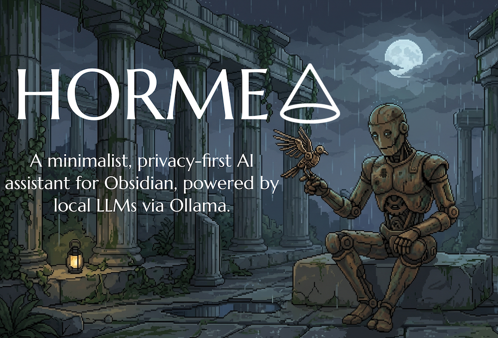

[](https://github.com/DuckTapeKiller/horme/stargazers)
[](https://github.com/DuckTapeKiller/horme/issues)
[](https://github.com/DuckTapeKiller/horme/issues?q=is%3Aissue+is%3Aclosed)
[](https://github.com/DuckTapeKiller/horme/blob/main/manifest.json)
[](https://github.com/DuckTapeKiller/horme/releases)

# <span style="color:#7c3aed">&#9653; Horme</span>

*In Greek mythology, Horme (/ˈhɔːrmiː/; Ancient Greek: Ὁρμή) is the Greek spirit personifying energetic activity, impulse or effort (to do a thing), eagerness, setting oneself in motion, and starting an action, and particularly onrush in battle.*



---
> [!IMPORTANT]
> # Quick start
> 
> ## TLDR — For Non-Technical Users
> 
> To use this plugin's full capabilities, you need two local models:
> 1.  **An Indexing Model:** This model allows the plugin to interact with and index your notes.
> 2.  **An Interaction Model:** This is the model you will actually chat or “speak” with.
> 
> ---
> 
> ### Prerequisites: Setting up Ollama
> 
> We recommend using **Ollama** to manage your local models. You can download it here: [Download Ollama](https://ollama.com/download).
> 
> **1. Download the Indexing Model:**
> This model is *only* for indexing your vault in a compressed format; you cannot chat with it.
> *   **Recommended Model:** `nomic-embed-text:latest` (274 MB).
> *   **Command (in your terminal):**
>     ```bash
>     ollama pull nomic-embed-text:latest
>     ```
> **2. Download the Interaction Model:**
> This is the model you will use for asking questions.
> *   **Strong Recommendation:** `gemma4:e4b` (9.6 GB)
> *   **Command (in your terminal):**
>     ```bash
>     ollama pull gemma4:e4b
>     ```
> 
> 
> ### Manual Installation Steps
> 
> Once both models are downloaded, follow these steps to install Horme:
> 
> 1.  **Create Plugin Folder:**
>     *   Navigate to your hidden Obsidian folder: `.obsidian/plugins`
>     *   Create a new folder named `horme`.
> 
> 2.  **Download Plugin Files:**
>     *   Go to the repository releases page: [Horme Releases](https://github.com/DuckTapeKiller/horme/releases).
>     *   Download the three files from the most recent release:
>         *   `main.js`
>         *   `manifest.json`
>         *   `styles.css`
> 
> 3.  **Activate in Obsidian:**
>     *   Go to **Settings** in Obsidian.
>     *   Scroll down and toggle on **“Enable Local Vault Memory”**.
>     *   Select the indexing model you just downloaded: **`nomic-embed-text:latest`**.
>     *   Wait for the count in the status bar to finish processing.
> 
> ### Ready to Use
> 
> Once the indexing is complete, go to the **Horme chat box** and ask any question about your notes.
> 
> **Example Query:**
> > “I want to write an essay on modern art, help me find which of my notes can help me.”
>
> No data leaves your machine. No API keys. No cloud. Just your models, your notes, your rules. But if you still want to use cloud models, they are available in settings. 


---

## <span style="color:#7c3aed">&#9776; Table of Contents</span>

- [Installation](#-installation)
- [Requirements](#-requirements)
- [Features](#-features)
  - [Vault Brain (Local RAG)](#-vault-brain-local-rag)
  - [Semantic Tagging](#-semantic-tagging)
  - [Grammar Proofreading Engine](#-grammar-proofreading-engine)
  - [Frontmatter Summary Generation](#-frontmatter-summary-generation)
  - [AI Skills](#-ai-skills)
  - [Privacy Firewall](#-privacy-firewall)
  - [Chat Panel](#-chat-panel)
  - [Multi-Note Context](#-multi-note-context)
  - [Right-Click Context Menu](#-right-click-context-menu)
  - [Inline Diff Confirmation](#-inline-diff-confirmation)
  - [Status Bar Progress](#-status-bar-progress)
  - [Token Awareness](#-token-awareness)
  - [Note Context](#-note-context)
  - [Document Upload](#-document-upload)
  - [Chat History](#-chat-history)
  - [Export Conversation](#-export-conversation)
  - [System Prompt Presets](#-system-prompt-presets)
  - [Per-Note Frontmatter Prompts](#-per-note-frontmatter-prompts)
- [Providers](#-providers)
- [Settings](#-settings)
- [Release Files](#-release-files)
- [Author](#-author)
- [License](#-license)

---

## <span style="color:#7c3aed">&#9662; Installation</span>

1. Download `main.js`, `styles.css`, and `manifest.json`.
2. Create a folder named `horme` inside your vault's `.obsidian/plugins/` directory.
3. Place the three files inside that folder.
4. Open Obsidian &#10132; Settings &#10132; Community Plugins &#10132; enable **Horme**.

---

## <span style="color:#7c3aed">&#9670; Requirements</span>

| Dependency | Details |
|---|---|
| **Ollama** | Must be running locally at `http://127.0.0.1:11434` (configurable). |
| **Embedding Model** | Specialized model for RAG (e.g. `ollama pull nomic-embed-text` or `mxbai-embed-large`). |
| **Chat Model** | Pull a model with `ollama pull <model>` (e.g. `gemma3`, `llama3`). |
| **Obsidian** | v1.0.0 or later. |

---

## <span style="color:#7c3aed">&#9733; Features</span>

### <span style="color:#6d28d9">&#9655; Vault Brain (Local RAG)</span>

The Vault Brain gives the AI long-term memory of your entire knowledge base. It uses a high-performance, private Retrieval-Augmented Generation (RAG) engine.

- **Lean Indexing:** Horme does not store your text in the index. It stores character offsets and mathematical "fingerprints" (embeddings), reducing index size by 90% and keeping startup instant.
- **Auto-Pilot Indexing:** The system automatically detects when you create or modify a note and updates the index in the background (with a 2-second debounce to save resources).
- **Heading-Aware Chunking:** Notes are split into semantically meaningful chunks that preserve heading context, so the model knows which section a passage belongs to.
- **Model-Aware Prefixes:** The indexer automatically applies the correct asymmetric prefix convention for your embedding model (nomic-embed-text, mxbai-embed-large, or symmetric models), ensuring high-fidelity retrieval.
- **Multi-Query Fusion:** Search runs dual-embedding (full query + keyword distillation) for improved recall across your vault.
- **Model-Locked Integrity:** The index is versioned. If you change your embedding model in settings, the plugin detects the mismatch and prompts for a rebuild to prevent corrupted results.
- **Session Toggle:** A "Use Vault Brain" checkbox in the chat header lets you disable vault search per-session for faster responses when you don't need it.

---

### <span style="color:#6d28d9">&#9655; Semantic Tagging</span>

Manage large tag collections (3,000+ tags) with ease using the **Hybrid Tag Suggester**.

- **Keyword + Semantic:** Combines traditional word-matching with mathematical topic-matching. It finds specific names (like "Hernán Cortés") AND broad themes (like "Spanish History") simultaneously.
- **Intelligent Candidates:** From a collection of thousands, it selects the most relevant candidates and lets your local LLM make the final, precise selection.
- **Tag Index:** Dedicated tag brain that maps your entire hierarchy for instant retrieval. Use `Rebuild Tag Index` in settings to refresh.
- **Tag Button:** Quick access via the "Tags" button in the chat header.

---

### <span style="color:#6d28d9">&#9655; Grammar Proofreading Engine</span>

Feed the AI your own grammar manuals and style guides. Horme indexes them locally and consults them during proofreading.

- **Local Grammar Index:** Point the plugin to a folder containing your grammar reference notes. Horme chunks and indexes them for semantic retrieval.
- **Language-Aware Activation:** Set your grammar language in settings (e.g. "Español"). The grammar skill is only triggered when proofreading text in that language — English text won't invoke Spanish grammar rules.
- **Academic Precision:** When proofreading, the AI is explicitly instructed to consult your grammar manuals for non-obvious errors like false cognates, prepositional regimes, and orthotypography.

---

### <span style="color:#6d28d9">&#9655; Frontmatter Summary Generation</span>

Automatically generate concise summaries and write them directly into your notes' YAML frontmatter.

- **Configurable Field:** Choose the frontmatter key (e.g. `summary`, `resumen`, `abstract`) in settings.
- **Configurable Language:** Summaries are generated in your chosen language.
- **Two Access Points:** Use the "Summary" button in the chat header or the command palette (`Horme: Generate frontmatter summary`).
- **Overwrite Protection:** If a summary already exists, a confirmation dialog shows old vs. new before replacing.

---

### <span style="color:#6d28d9">&#9655; AI Skills</span>

Horme extends the LLM with modular skills that it can invoke autonomously during conversations and actions. Skills are tool calls the model emits when it needs external information.

| Skill | Type | Description |
|---|---|---|
| **Wikipedia Search** | &#127760; Web | Searches Wikipedia for factual verification. Supports multiple languages (`en`, `es`, `fr`, etc.). Returns summaries and relevant article sections with source URLs. |
| **Wiktionary Lookup** | &#127760; Web | Looks up word definitions, etymology, and usage notes. Useful for distinguishing false friends and verifying word existence. Multi-language. |
| **DuckDuckGo Instant Answer** | &#127760; Web | Quick facts and topic summaries for recent events, technical specs, and niche topics not covered by Wikipedia. No API key required. |
| **Date Calculator** | &#128187; Local | Computes time differences between dates, verifies day-of-week for historical dates, and checks chronological consistency. Pure computation, zero latency. |
| **Vault Linker** | &#128218; Index | Finds semantically related notes within your vault. Privacy-guarded — only available to local providers (or with explicit cloud opt-in). |
| **Taxonomy Scholar** | &#128218; Index | Retrieves the full list of existing tags to ensure consistent tagging. |
| **Grammar Scholar** | &#128218; Index | Consults your local grammar and orthography manuals for precision checks on syntax, false friends, and orthotypography. |

---

### <span style="color:#6d28d9">&#9655; Privacy Firewall</span>

Horme is built with a "Privacy-First" architecture with four layers of protection on vault data.

- **Cloud Lock:** If you switch to a cloud provider (Claude, Gemini, etc.), the Vault Brain, background indexer, and Vault Linker skill are immediately disabled. No private note content is processed by external servers.
- **Skill Suppression:** When vault search is locked, the Vault Linker skill is hidden from the model's instructions entirely — the model never even knows it exists.
- **Defence in Depth:** Even if a prompt-injected model somehow attempts to call the vault skill, the skill itself refuses to execute when access is locked.
- **Context Warning:** A one-time confirmation dialog is required before sending the current note context to a cloud provider.
- **Explicit Opt-In:** An "Allow Cloud Provider Access" toggle (with a confirmation prompt) is required before any vault content can be sent to cloud providers.
- **Tag & Grammar indexes** are available to all providers — they contain only tag names and grammar manual excerpts, not private vault content.

---

### <span style="color:#6d28d9">&#9655; Chat Panel</span>

Open the chat panel from the ribbon icon (&#9653;) or the command palette (`Horme: Open chat panel`).

- **Streaming UI:** Responses rendered as live Markdown with code blocks, lists, and full text selection.
- **Connection Indicator:** Live coloured dot showing Ollama status.
- **Model Selector:** Switch between available models directly from the chat header.
- **Micro-Batching:** Optimized for Apple Silicon; handles large context windows by processing embeddings in small, stable groups.

---

### <span style="color:#6d28d9">&#9655; Multi-Note Context</span>

Send multiple notes as context to the AI in a single conversation.

- **Note Picker:** Click "+ Add notes" in the chat header to open a fuzzy search modal. Select up to 5 notes.
- **Selected Notes Label:** A compact label shows which notes are currently included as context.
- **Clear All:** One-click button to remove all selected notes.
- **Per-Session:** Selections persist across messages within the same chat session and are cleared on new conversations.

---

### <span style="color:#6d28d9">&#9655; Right-Click Context Menu</span>

Select text in any note to access professional editing tools via right-click &#10132; **Horme**:

| Action | Description |
|---|---|
| **Proofread** | Fixes grammar, spelling, and punctuation. Consults your grammar manuals for the configured language. |
| **Rewrite** | Opens a tone picker: Formal, Friendly, Academic, Sarcastic, Aggressive, or Humanise. |
| **Expand** | Adds detail while preserving meaning. |
| **Summarize** | Condenses text to key points. |
| **Beautify Format** | Fixes heading hierarchy, normalizes lists and spacing. |
| **Fact Check** | Verifies each claim against Wikipedia. Returns structured verdicts with source citations. |
| **Translate** | Opens a language input modal. Translates to any language. |

---

### <span style="color:#6d28d9">&#9655; Inline Diff Confirmation</span>

Before any text is changed, Horme shows a side-by-side **Original vs. Replacement** modal. You review the changes and explicitly click **Accept** or **Cancel**. All changes are fully undoable with `Ctrl+Z`.

---

### <span style="color:#6d28d9">&#9655; Status Bar Progress</span>

A professional progress indicator appears in the Obsidian status bar during background tasks:
- **&#9679; Indexing 47 / 3210**

The indicator is color-coded and disappears automatically when the task is finished.

---

### <span style="color:#6d28d9">&#9655; Token Awareness</span>

Horme estimates the total token count of the conversation before sending. If the context (system prompt + note context + documents + history) exceeds **~6,000 tokens**, a warning notice is displayed to prevent silent truncation.

---

### <span style="color:#6d28d9">&#9655; Note Context</span>

Toggle **"Use current note as context"** to inject the active note's content. The plugin tracks the last focused markdown editor live, so switching tabs updates the context automatically.

---

### <span style="color:#6d28d9">&#9655; Document Upload</span>

Upload PDF and DOCX files directly into the chat. Horme extracts the text content (including structural metadata for PDFs) and injects it as context for the model.

---

### <span style="color:#6d28d9">&#9655; Chat History</span>

Manage your past conversations via the History panel (&#128337;):
- **Debounced Saving:** History is saved every 2 seconds during active chat to minimize disk I/O.
- **Capped Storage:** Retains up to 200 conversations; oldest entries are automatically trimmed.
- **Flush on Close:** In-progress conversations are guaranteed to save when the chat panel is closed.

---

### <span style="color:#6d28d9">&#9655; Export Conversation</span>

Export any conversation as a formatted Markdown note (&#11015;). The file is saved to the configured export folder with a timestamped filename, preserving the distinction between User and Assistant messages.

---

### <span style="color:#6d28d9">&#9655; System Prompt Presets</span>

Create reusable system prompts (e.g. "Constitutional Law Professor", "Code Auditor", "Spanish Tutor") in settings. Switch between them from the preset dropdown in the chat header — no need to retype.

---

### <span style="color:#6d28d9">&#9655; Per-Note Frontmatter Prompts</span>

Override the global system prompt for specific notes by adding a `horme-prompt` key to the YAML frontmatter. This allows for note-specific personas that activate automatically when the note is in context.

```yaml
---
horme-prompt: "You are an expert in constitutional law. Always cite legal precedent."
---
```

---

## <span style="color:#7c3aed">&#9741; Providers</span>

Horme supports multiple AI providers. Local providers are recommended for privacy.

| Provider | Type | Notes |
|---|---|---|
| **Ollama** | &#127968; Local | Default. Full feature access including Vault Brain. |
| **LM Studio** | &#127968; Local | Full feature access including Vault Brain. |
| **Claude** | &#9729; Cloud | Vault Brain requires explicit opt-in. |
| **Gemini** | &#9729; Cloud | Vault Brain requires explicit opt-in. |
| **OpenAI** | &#9729; Cloud | Vault Brain requires explicit opt-in. |
| **Groq** | &#9729; Cloud | Vault Brain requires explicit opt-in. |
| **OpenRouter** | &#9729; Cloud | Vault Brain requires explicit opt-in. |

---

## <span style="color:#7c3aed">&#9881; Settings</span>

| Setting | Default | Description |
|---|---|---|
| **Ollama Base URL** | `http://127.0.0.1:11434` | Endpoint for the Ollama API. |
| **Embedding Model** | `nomic-embed-text` | Model used for indexing (e.g. `nomic-embed-text`, `mxbai-embed-large`). |
| **Vault Brain** | `Off` | Toggle for the semantic RAG engine and background indexer. |
| **Allow Cloud RAG** | `Off` | Explicitly allow vault content to be sent to cloud providers. |
| **Grammar Manual Folder** | `Gramática` | Folder containing your grammar reference notes. |
| **Grammar Language** | `Español` | Language your grammar manuals cover. Proofreading only consults manuals for this language. |
| **Summary Field** | `summary` | Frontmatter key where generated summaries are stored. |
| **Summary Language** | `Español` | Language summaries are written in. |
| **Max Tag Candidates** | `250` | Number of existing tags considered for semantic suggestions. |
| **Export Folder** | `HORME` | Vault-relative path for saved notes and exports. |

---

## <span style="color:#7c3aed">&#9744; Release Files</span>

To install Horme, you need exactly three files:

| File | Purpose |
|---|---|
| `main.js` | Bundled plugin logic (includes `pdfjs-dist`). |
| `styles.css` | Chat panel and modal styling. |
| `manifest.json` | Plugin metadata for Obsidian. |

---

## <span style="color:#7c3aed">&#9998; Author</span>

**DuckTapeKiller**

---

## <span style="color:#7c3aed">&#9878; License</span>

MIT
